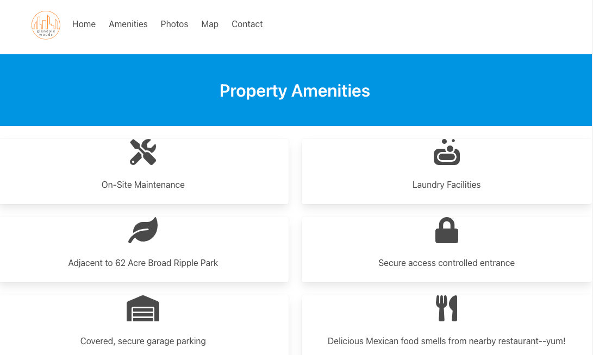
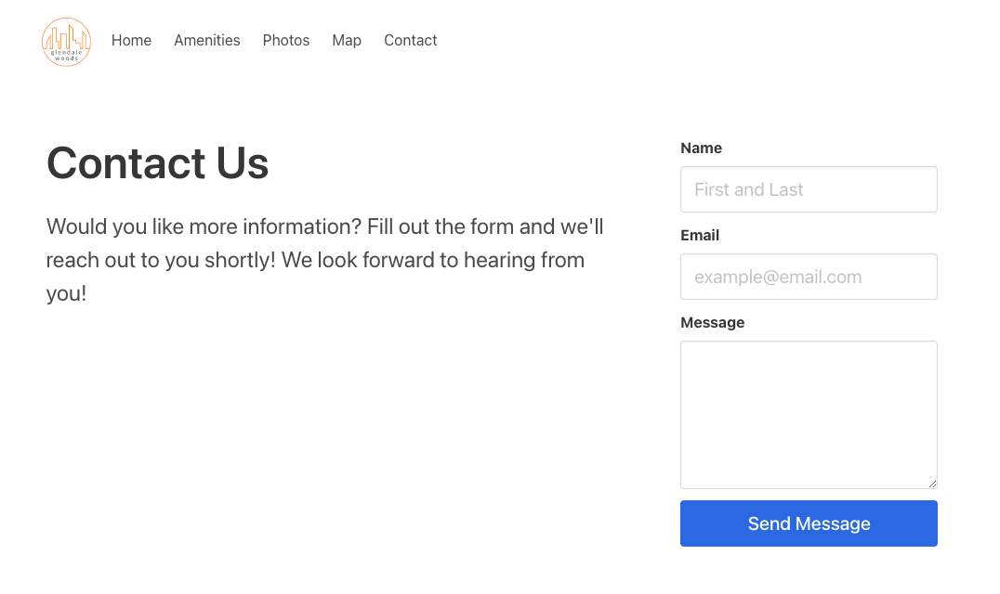

# Glendale Woods Apartments

This website was developed for an apartment complex in Indianapolis, IN.  This project was built with [Create React App] (https://github.com/facebook/create-react-app).

Working version of this [website](https://glendalewoods.netlify.app/home).

Get in touch with me or check out more of my work [here](https://lanejm.com).

You can also check out my [github](https://github.com/lanejm). 

## Available Scripts

In the project directory, you can run:

### `npm start`

Runs the app in the development mode.\
Open [http://localhost:3000](http://localhost:3000) to view it in the browser.

The page will reload if you make edits.\
You will also see any lint errors in the console.

## Dependencies

This project utilizes [Bulma](https://bulma.io/) for CSS framework.

You can learn more about getting started with this framework [here](https://bulma.io/documentation/overview/start/). 

## Previews

